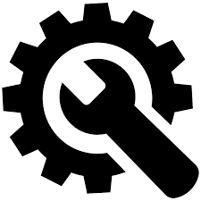

<!--
*** Thanks for checking out the Best-README-Template. If you have a suggestion
*** that would make this better, please fork the repo and create a pull request
*** or simply open an issue with the tag "enhancement".
*** Thanks again! Now go create something AMAZING! :D
***
***
***
*** To avoid retyping too much info. Do a search and replace for the following:
*** yamaha-bps, cbr_utils, twitter_handle, thomas_gurriet@yamaha-motor.com, Cyber Utilities, Collection of various programmatic tools.
-->


<!-- PROJECT SHIELDS -->
<!--
*** I'm using markdown "reference style" links for readability.
*** Reference links are enclosed in brackets [ ] instead of parentheses ( ).
*** See the bottom of this document for the declaration of the reference variables
*** for contributors-url, forks-url, etc. This is an optional, concise syntax you may use.
*** https://www.markdownguide.org/basic-syntax/#reference-style-links
-->
[![Contributors][contributors-shield]][contributors-url]
[![Forks][forks-shield]][forks-url]
[![Stargazers][stars-shield]][stars-url]
[![Issues][issues-shield]][issues-url]
[![MIT License][license-shield]][license-url]


<!-- PROJECT LOGO -->
<br />
<p align="center">
  <a href="https://github.com/yamaha-bps/cbr_utils">
    
  </a>

  <h3 align="center">Cyber Utilities</h3>

  <p align="center">
    Collection of various programmatic tools.
    <br />
    <a href="https://github.com/yamaha-bps/cbr_utils"><strong>Explore the docs »</strong></a>
    <br />
    <br />
    <a href="https://github.com/yamaha-bps/cbr_utils/issues">Report Bug</a>
    ·
    <a href="https://github.com/yamaha-bps/cbr_utils/issues">Request Feature</a>
  </p>
</p>


<!-- TABLE OF CONTENTS -->
<details open="open">
  <summary>Table of Contents</summary>
  <ol>
    <li>
      <a href="#about-the-project">About The Project</a>
      <ul>
        <li><a href="#built-with">Built With</a></li>
      </ul>
    </li>
    <li>
      <a href="#getting-started">Getting Started</a>
      <ul>
        <li><a href="#prerequisites">Prerequisites</a></li>
        <li><a href="#installation">Installation</a></li>
      </ul>
    </li>
    <li><a href="#roadmap">Roadmap</a></li>
    <li><a href="#contributing">Contributing</a></li>
    <li><a href="#license">License</a></li>
    <li><a href="#contact">Contact</a></li>
    <li><a href="#acknowledgements">Acknowledgements</a></li>
  </ol>
</details>


<!-- ABOUT THE PROJECT -->
## About The Project

### Built With

* [Libboost](https://www.boost.org/)
* [yaml-cpp](https://github.com/jbeder/yaml-cpp)
* [GTest](https://github.com/google/googletest)


<!-- GETTING STARTED -->
## Getting Started

To get a local copy up and running follow these simple steps.


### Install dependencies

* libboost
  ```sh
  sudo apt install libboost-dev
  ```

* yaml-cpp
  ```sh
  sudo apt install libyaml-cpp-dev
  ```

* GTest (only necessary to build tests)
  ```sh
  sudo apt install libgtest-dev
  ```


### Build and Install

1. Clone the repo
   ```sh
   git clone https://github.com/yamaha-bps/cbr_utils.git
   ```
2. Make build directory
   ```sh
   mkdir cbr_utils/build
   ```
3. Build
   ```sh
   cd cbr_utils/build
   cmake .. -DBUILD_TESTING=ON -DBUILD_EXAMPLES=ON
   make
   ```
4. Install
   ```sh
   sudo make install
   ```
5. Verify successful install (tests should all pass)
   ```sh
   make test
   ```

6. Uninstall if you don't like it
   ```sh
   sudo make uninstall
   ```

<!-- USAGE EXAMPLES -->


<!-- ROADMAP -->
## Roadmap

See the [open issues](https://github.com/yamaha-bps/cbr_utils/issues) for a list of proposed features (and known issues).


<!-- CONTRIBUTING -->
## Contributing

Contributions are what make the open source community such an amazing place to be learn, inspire, and create. Any contributions you make are **greatly appreciated**.

1. Fork the Project
2. Create your Feature Branch (`git checkout -b feature/AmazingFeature`)
3. Commit your Changes (`git commit -m 'Add some AmazingFeature'`)
4. Push to the Branch (`git push origin feature/AmazingFeature`)
5. Open a Pull Request


<!-- LICENSE -->
## License

Distributed under the MIT License. See `LICENSE` for more information.


<!-- CONTACT -->
## Contact

Thomas Gurriet - thomas_gurriet@yamaha-motor.com

Project Link: [https://github.com/yamaha-bps/cbr_utils](https://github.com/yamaha-bps/cbr_utils)


<!-- ACKNOWLEDGEMENTS -->
## Acknowledgements

* [Yamaha Motor Corporation](https://yamaha-motor.com/)


<!-- MARKDOWN LINKS & IMAGES -->
<!-- https://www.markdownguide.org/basic-syntax/#reference-style-links -->
[contributors-shield]: https://img.shields.io/github/contributors/yamaha-bps/cbr_utils.svg?style=for-the-badge
[contributors-url]: https://github.com/yamaha-bps/cbr_utils/graphs/contributors
[forks-shield]: https://img.shields.io/github/forks/yamaha-bps/cbr_utils.svg?style=for-the-badge
[forks-url]: https://github.com/yamaha-bps/cbr_utils/network/members
[stars-shield]: https://img.shields.io/github/stars/yamaha-bps/cbr_utils.svg?style=for-the-badge
[stars-url]: https://github.com/yamaha-bps/cbr_utils/stargazers
[issues-shield]: https://img.shields.io/github/issues/yamaha-bps/cbr_utils.svg?style=for-the-badge
[issues-url]: https://github.com/yamaha-bps/cbr_utils/issues
[license-shield]: https://img.shields.io/github/license/yamaha-bps/cbr_utils.svg?style=for-the-badge
[license-url]: https://github.com/yamaha-bps/cbr_utils/blob/master/LICENSE